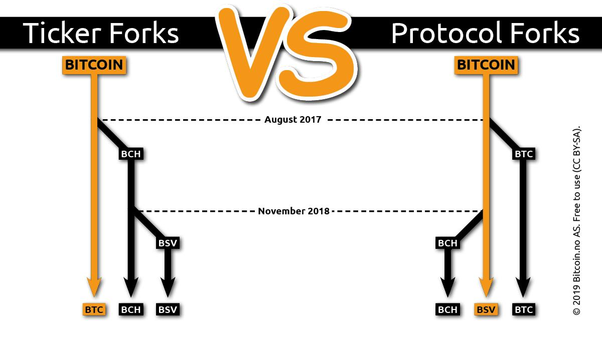

# Mastering Bitcoin SV

比特币诞生至今，已经过了十个年头。在此期间，因比特币几年的[扩容争议](http://1bsv.cn/%e6%af%94%e7%89%b9%e5%b8%81%e6%89%a9%e5%ae%b9%e7%ba%b7%e4%ba%89/)无果，比特币分叉为  Bitcoin Coin 和 Bitcoin Cash，随后又分叉为 Bitcoin ABC 和 Bitcoin SV。

尽管比特币的 Ticker 多次变更，Bitcoin SV，即原版的比特币，旨在恢复原始比特币协议，保持其协议稳定且允许其大规模扩容。Bitcoin SV 将秉承维护中本聪在2008年白皮书《[比特币：一个点对点电子现金系统](https://bitcoinsv.io/bitcoin/)》中所阐述的愿景。

中本聪所设计的比特币其实一直没有完全实现，比特币还有着无限的潜力有待发掘。本项目旨在让更多人理解中本聪的设计，更好地迎接【[Bitcoin SV 创世纪](https://bitcoinsv.io/2019/04/17/the-roadmap-to-genesis-part-1/)】升级计划的到来。

> “比特币的本质是，第0.1版一经发布，其核心设计即已固定，并在整个生命周期中保持不变。”
- <cite>中本聪（Satoshi Nakamoto)</cite>

本书 Fork 自[《精通比特币》云天明的中文译本](https://github.com/tianmingyun/MasterBitcoin2CN)，并参考 [Mastering Bitcoin - Second Edition](https://github.com/bitcoinbook/bitcoinbook/) 原文进行整理。对于原文及译者的辛勤劳动，在此一并致谢。

本书将修正部分偏离比特币原始设计的内容，向读者展示中本聪的设计的精妙之处。欢迎读者在 github 上提交勘误，也可以发至邮箱 imcoddy@gmail.com 反馈。

## Mastering Bitcoin - Second Edition 版权说明

The [second_edition](https://github.com/bitcoinbook/bitcoinbook/tree/second_edition) branch, is the source for the published versions of Mastering Bitcoin (Second Edition).

The tag [second_edition_print_1](https://github.com/bitcoinbook/bitcoinbook/releases/tag/second_edition_print_1), corresponds to the first print of the second edition.

Mastering Bitcoin - Second Edition by [Andreas M. Antonopoulos LLC](https://antonopoulos.com/) is licensed under a [Creative Commons Attribution-NonCommercial-NoDerivatives 4.0 International License](http://creativecommons.org/licenses/by-nc-nd/4.0/).

It is expected that the second edition will be released under a CC-BY-SA license within a year of publication.
